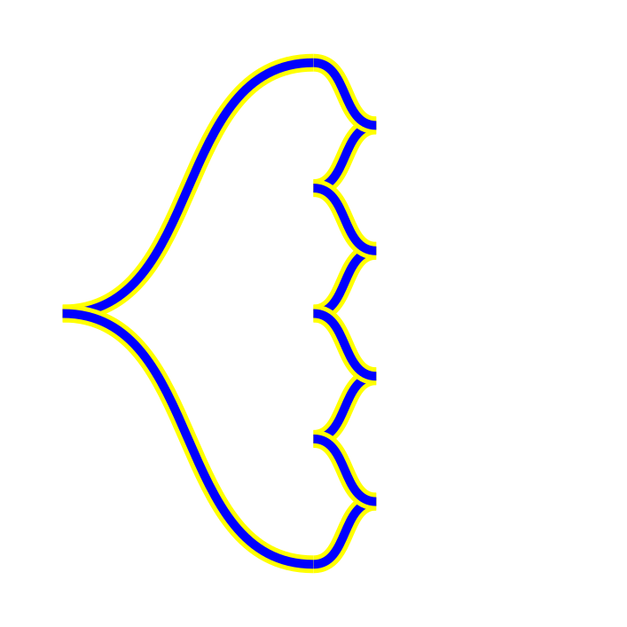
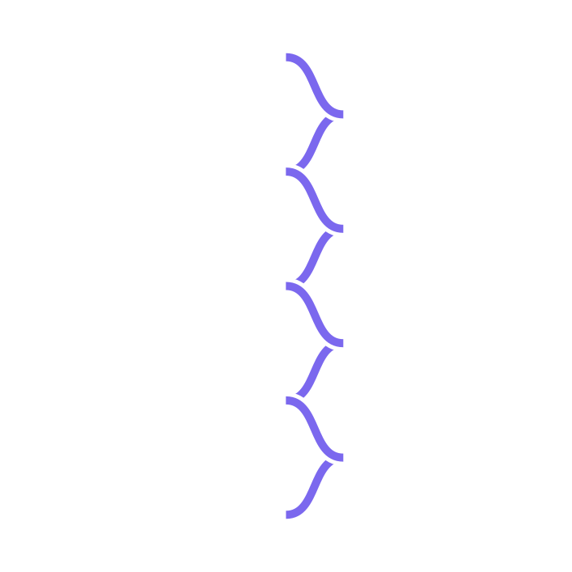

import G2FP from "~/components/tools/G2FP.astro";

## Instructions

1. Create a $n\times n$ table by setting the size and pressing the button.
2. Select the colors for your knot.
3. Select the scale, size of the strands, for your knot.
4. Select the eccentricity, how much the control points pull, for your knot.
5. Fill in the table with the grid diagram.
   For info on using grid diagrams to define Legendrian knots see
   [10.48550/arXiv.1903.12256](http://dx.doi.org/10.48550/arXiv.1903.12256) or
   [10.2140/agt.2010.10.293](http://dx.doi.org/10.2140/agt.2010.10.293).
    1. Note there is no error handling so if something goes wrong refresh the page and try again
6. Click generate to get the image.
    1. Click "Download" to download a copy of the image.

---

<G2FP />

---

## Sample images

| x   | o   |     |     |     |
| --- | --- | --- | --- | --- |
|     | x   | o   |     |     |
|     |     | x   | o   |     |
|     |     |     | x   | o   |
| o   |     |     |     | x   |

| x   | o   |     |     |     |
| --- | --- | --- | --- | --- |
|     | x   | o   |     |     |
|     |     | x   | o   |     |
|     |     |     | x   | o   |
|     |     |     |     | x   |

|     | o   |     |     | x   |
| --- | --- | --- | --- | --- |
| x   |     | o   |     |     |
|     | x   |     | o   |     |
|     |     | x   |     | o   |
| o   |     |     | x   |     |

| x   |     | o   |
| --- | --- | --- |
|     |     |     |
| o   |     | x   |

|     | x   |     |     | o   |     |     |
| --- | --- | --- | --- | --- | --- | --- |
| x   |     | o   |     |     |     |     |
|     | o   |     |     |     | x   |     |
|     |     |     |     | x   |     | o   |
| o   |     |     | x   |     |     |     |
|     |     | x   |     |     | o   |     |
|     |     |     | o   |     |     | x   |

